# My Experience Trying To Access Inginious

**By Paolo Gonzalez - 10 November, 2025**

As someone whose first experience with autograding at CSU Chico was with the deprecated Turnin system, one might think that I would enjoy using the newer and Inginious autograder. I have only taken one class that used this new website, and I only used it a few times to submit assignments. However, as a tutor for CSCI 111, where the bulk of the course work is stored on Inginious, I occasionally log into the site to check what concepts the students in the class are currently learning.

My first time trying to log in to the website in a while, I faced a number of hurdles just to access the page. Some of these problems came from Inginoius itself, but others stemmed from the broader CSU Chico online ecosystem. From a **usability** perspective (the ease of which users can accomplish their goals), this experience failed several **heuristics** (guidelines for evaluating a product’s usability). The most notable of these were Error prevention, Error Recovery, and Help/Documentation.

---

When I first entered the URL for the website, I got a “site can’t be reached” error. I got no feedback on why I could not reach the site.

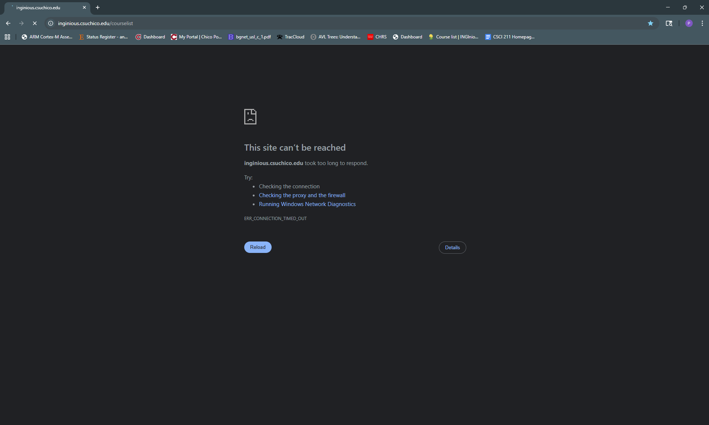

---

I searched for official documentation for using Inginious at CSU Chico, but found nothing useful in the first page of results.

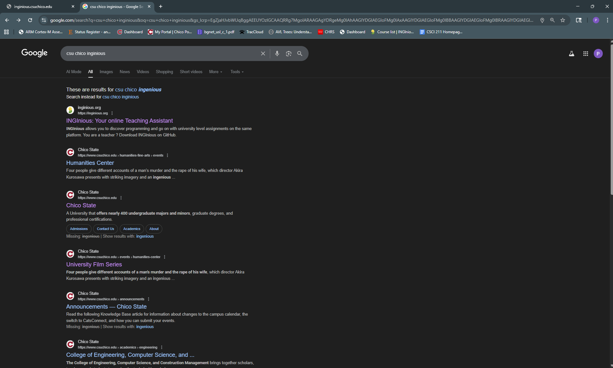

---

I searched for Inginious by itself, and found a version of the site that is not connected to the CSU Chico ecosystem.

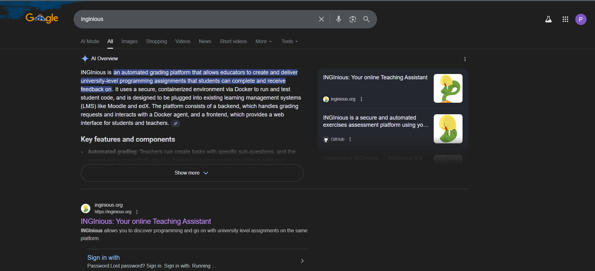

---

When I tried to sign into that version, I saw SSO (Single Sign On) options for GitHub and Linkedin, but saw none for CSU Chico.

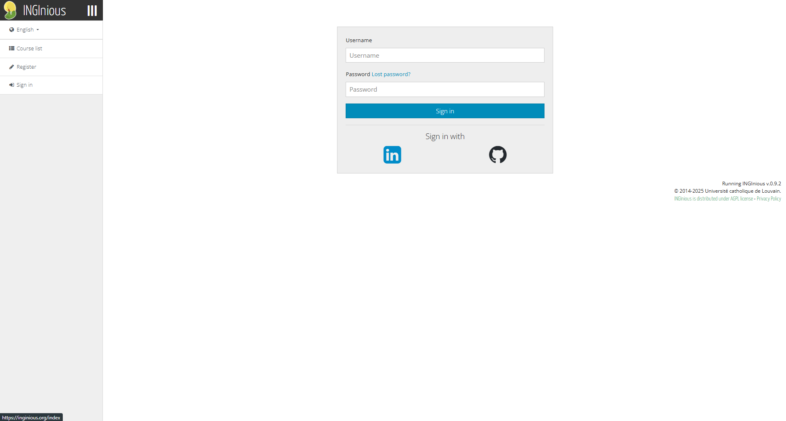

---

After checking the CSCI 111 Canvas course page, I discovered that I needed to be connected to the university VPN. This also slowed me down as the VPN never keeps me signed in or saves my two factor authentication state.

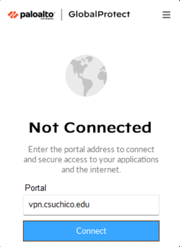 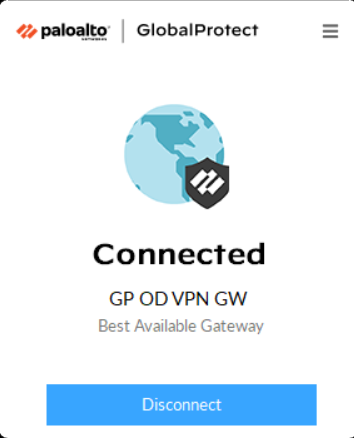

---

When I tried CSU Chico Inginous URL again I got a “404 Not Found” page which offered nothing in the way of error recovery.

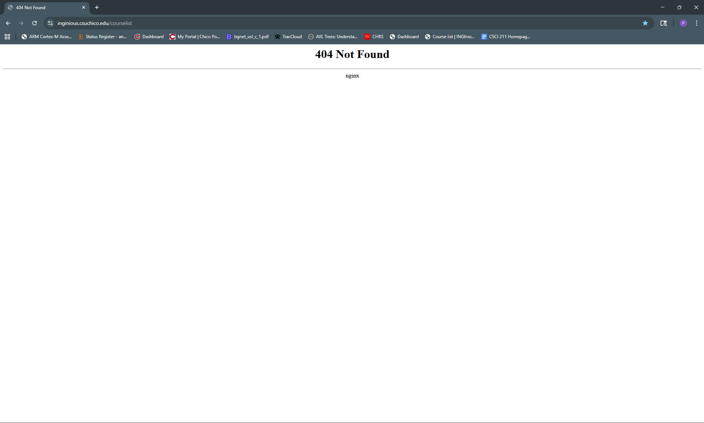

---

I decided to search again for information about CSU Chico Inginious and saw a promising link detailing Academic applications used at Chico state.

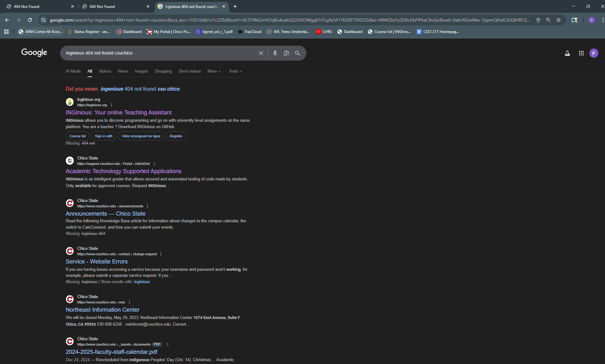

---

I found this entry on the website and felt like I was getting close to a solution.

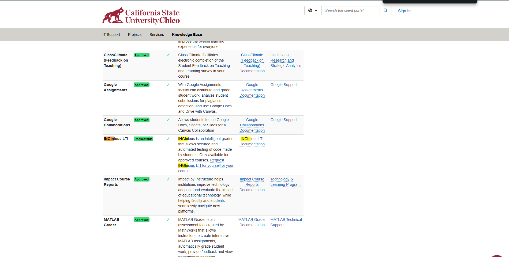

---

It ended up being documentation for how teachers can use it. Not what I am looking for.
I also checked the CSCI 111 Canvas page for info about this (not that it should fall to a canvas page to give documentation on this website) and found no relevant information.

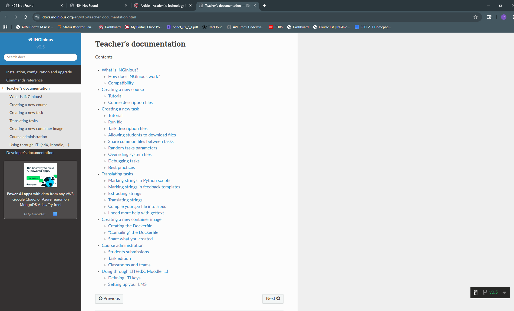

---

I then checked with a friend who currently uses Inginious for one of their classes and found out that I need to clear my cookies on Chrome to fix this problem. This would have signed me out of all the websites I was currently signed into, so I opted to use an incognito tab instead.

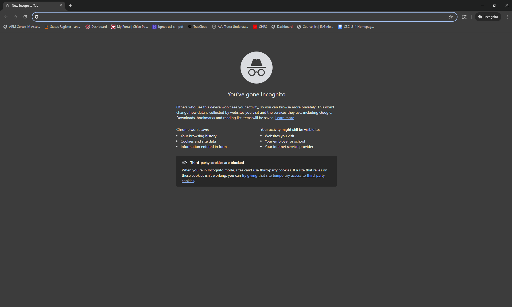

---

I finally made it to the Inginious page for CSU Chico, but I need to sign in to the SSO again since I am on an incognito tab.

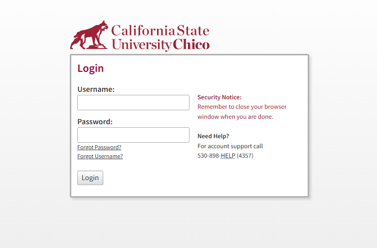

---

I was finally able to access my enrolled courses to check in on the concepts which the students are currently learning.

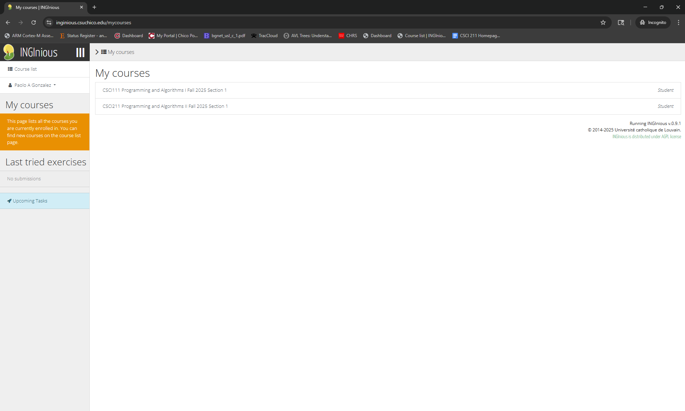
